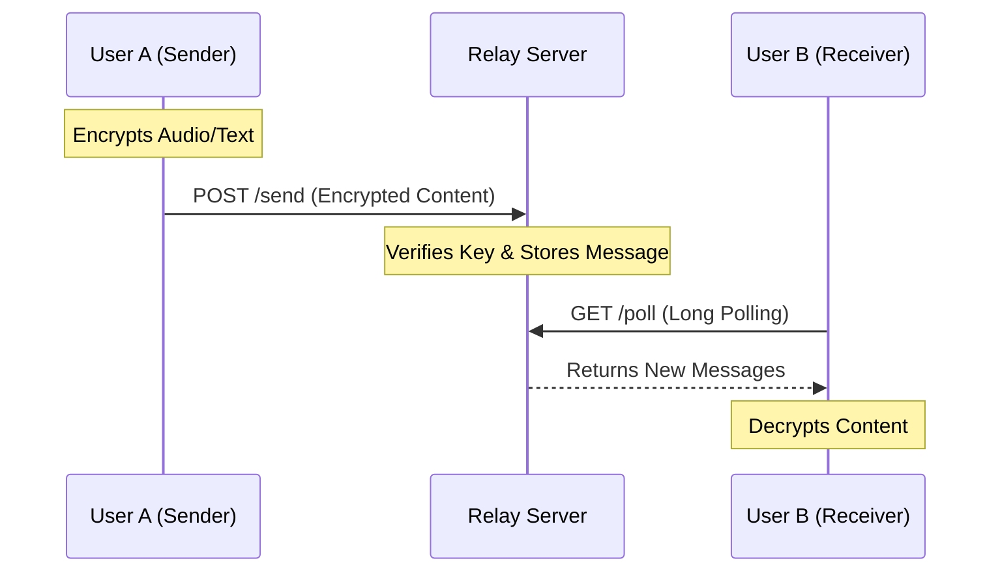

# Cuckoo Relay Server (Open Source)

[](https://opensource.org/licenses/MIT)
[](https://deploy.workers.cloudflare.com/?url=https://github.com/wowofun/CuckooRelayServer.git)
[](https://github.com/wowofun/CuckooRelayServer/pulls)

Language: **English** | [中文](README_CN.md)

A secure, private, and open-source relay server for **Cuckoos - Encrypted Walkie Talkie**.

## Table of Contents
- [Features](#features)
- [How It Works](#how-it-works)
- [Deployment Options](#deployment-options)
  - [Option 1: Cloudflare Workers (Recommended)](#option-1-cloudflare-workers-recommended)
  - [Option 2: Docker / VPS](#option-2-docker--vps)
- [Usage in App](#usage-in-app)
- [Documentation](#documentation)
- [Privacy & Security](#privacy--security)
- [Contributing](#contributing)
- [License](#license)

## Features
- **Zero Cost**: Runs entirely on Cloudflare Workers Free Tier + D1 Database.
- **Privacy First**: Messages are isolated by your secret Connection Key.
- **No Maintenance**: Serverless architecture, no servers to manage.
- **One-Click Deploy**: Setup in under 2 minutes.

## How It Works

### 1. Channel Isolation
Your **Connection Key** is the only thing that defines a "Chat Room". It is hashed into a unique Channel ID, ensuring that only people with the same key can communicate.

```mermaid
graph TD
    Key[Connection Key: "my-secret-password"] -->|SHA-256 Hash| ChannelID[Channel ID: "a8f3..."]
    UserA[User A] -->|Uses Key| ChannelID
    UserB[User B] -->|Uses Key| ChannelID
    
    ChannelID -->|Isolated| Messages[(Messages Database)]
    
    style Key fill:#f9f,stroke:#333,stroke-width:2px
    style ChannelID fill:#bbf,stroke:#333,stroke-width:2px
```

### 2. Message Flow
The server acts as a relay. It receives encrypted messages and holds them until recipients pick them up via Long Polling.



## Deployment Options

### Option 1: Cloudflare Workers (Recommended)
Free, fast, and requires zero maintenance.

1.  **Run the deployment script:**
    ```bash
    ./deploy.sh
    ```
2.  Follow the instructions on screen.

### Option 2: Docker / VPS
Run on any server (Ubuntu, CentOS, AWS, DigitalOcean, etc.).

1.  **Build and Run with Docker:**
    ```bash
    docker build -t cuckoo-relay .
    docker run -d -p 8787:8787 -v $(pwd)/data:/data cuckoo-relay
    ```

2.  **Or Run with Node.js directly:**
    ```bash
    npm install
    node server.js
    ```

## Usage in App
1.  Open **Cuckoos App**.
2.  Go to **Settings** -> **Remote Connection**.
3.  Enter your server URL (e.g., `https://your-server.com` or `http://your-ip:8787`).
4.  Enter any **Connection Key** (shared password).

## Documentation
- [OpenClaw Integration Guide](OPENCLAW_INTEGRATION.md) - Learn how to connect bots or external systems.

## Privacy & Security
- **End-to-End Encryption**: The app encrypts audio *before* sending.
- **No Logs**: This relay server only stores messages temporarily for delivery.
- **Channel Isolation**: Your Connection Key is hashed to create a unique channel ID.

## Contributing
Contributions are welcome! Please feel free to submit a Pull Request.

## License
This project is licensed under the MIT License - see the [LICENSE](LICENSE) file for details.
