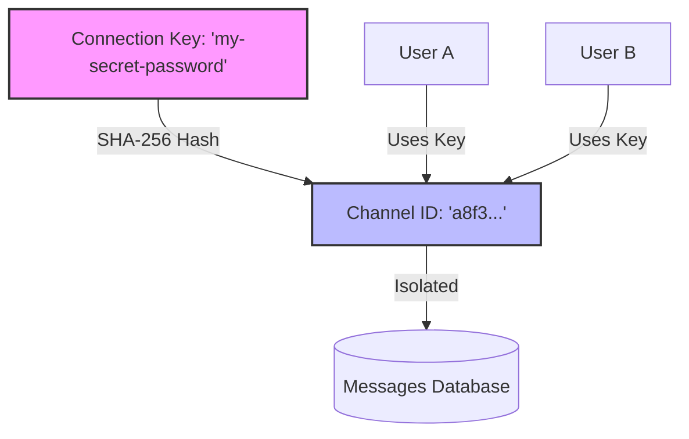
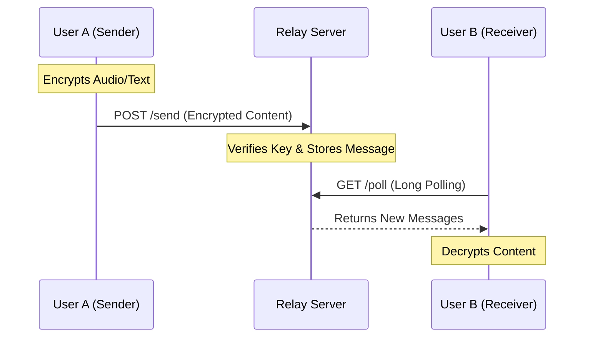

# Cuckoo Relay Server (Open Source)

[](https://opensource.org/licenses/MIT)
[](https://deploy.workers.cloudflare.com/?url=https://github.com/wowofun/CuckooRelayServer.git)
[](https://github.com/wowofun/CuckooRelayServer/pulls)

Language: **English** | [中文](README_CN.md)

This is the official self-hosted relay server for the Cuckoos iOS App. By deploying this lightweight script to your own Cloudflare account (Free Tier), you can enable secure, remote communication between your devices and friends.

## Table of Contents
- [Features](#features)
- [How It Works](#how-it-works)
- [Deployment Guide](#deployment-guide)
  - [Option 1: One-Click Button](#option-1-one-click-button-recommended)
  - [Option 2: Command Line](#option-2-command-line-for-developers)
- [App Configuration](#app-configuration)
- [Documentation](#documentation)
- [Technical Details](#technical-details)
- [Contributing](#contributing)
- [License](#license)

## Features

- **Zero Cost**: Runs entirely on Cloudflare Workers Free Tier + D1 Database.
- **Privacy First**: Messages are isolated by your secret Connection Key.
- **No Maintenance**: Serverless architecture, no servers to manage.
- **One-Click Deploy**: Setup in under 2 minutes.

## How It Works

### 1. Channel Isolation
Your **Connection Key** is the only thing that defines a "Chat Room". It is hashed into a unique Channel ID, ensuring that only people with the same key can communicate.



### 2. Message Flow
The server acts as a relay. It receives encrypted messages and holds them until recipients pick them up via Long Polling.



## Deployment Guide

### Option 1: One-Click Button (Recommended)

[](https://deploy.workers.cloudflare.com/?url=https://github.com/wowofun/CuckooRelayServer.git)

1. Click the button above.
2. Authorize Cloudflare.
3. Follow the instructions to create a D1 database named `cuckoos-db`.
4. Copy your Worker URL (e.g., `https://cuckoo-relay.yourname.workers.dev`).

### Option 2: Command Line (For Developers)

1. Install Node.js and Wrangler CLI:
   ```bash
   npm install -g wrangler
   ```

2. Login to Cloudflare:
   ```bash
   wrangler login
   ```

3. Run the deployment script:
   ```bash
   chmod +x deploy.sh
   ./deploy.sh
   ```

4. The script will automatically:
   - Create a D1 database.
   - Deploy the worker code.
   - Output your Server URL.
   
   *Note: Database tables are auto-initialized on first use.*

## App Configuration

1. Open Cuckoos App on your iPhone.
2. Go to **Settings -> Remote Connection**.
3. Enable "Remote Connection".
4. Enter your **Server URL** (from step 3).
5. Enter any **Connection Key** (e.g., `my-secret-password-123`).
   - *Note: Share this Key ONLY with friends you want to chat with. Anyone with the same Key will be in the same "chat room".*

## Documentation
- [OpenClaw Integration Guide](OPENCLAW_INTEGRATION.md) - Connect bots and external systems.

## Technical Details

- **Runtime**: Cloudflare Workers (Edge Network)
- **Database**: Cloudflare D1 (SQLite)
- **Protocol**: HTTPS Long Polling (Simulated Push)
- **Security**: Channel Isolation via SHA-256 Hashing of Connection Key.

## Contributing
Contributions are welcome! Please feel free to submit a Pull Request.

## License

This project is licensed under the MIT License - see the [LICENSE](LICENSE) file for details.
